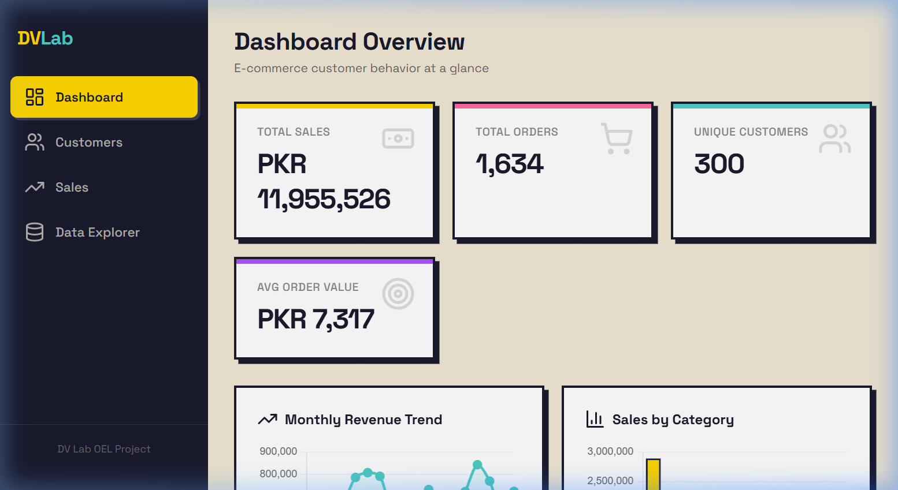
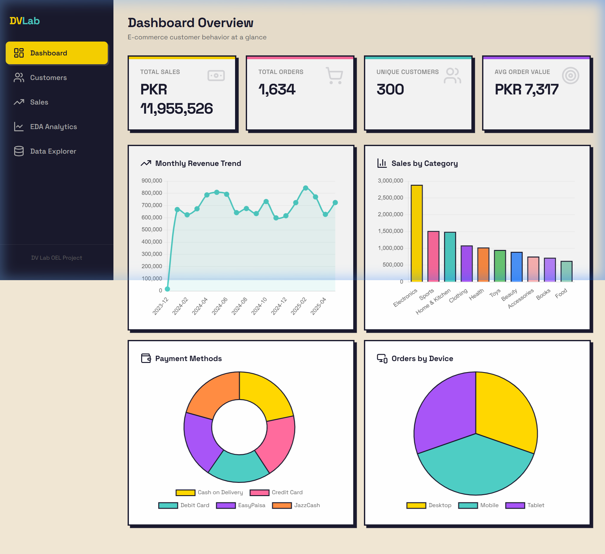
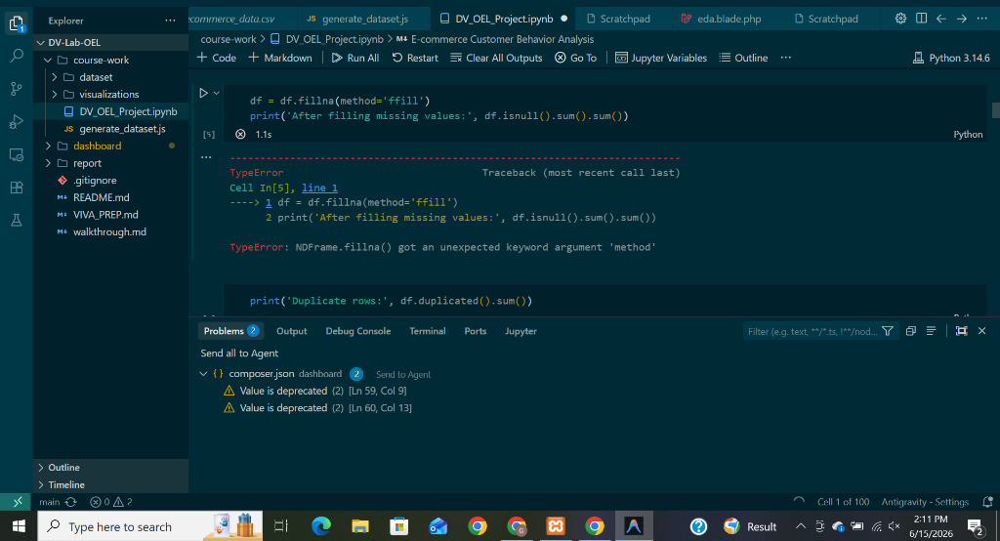
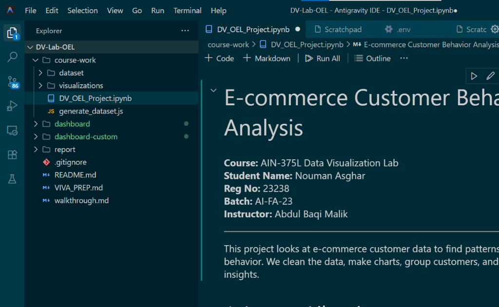
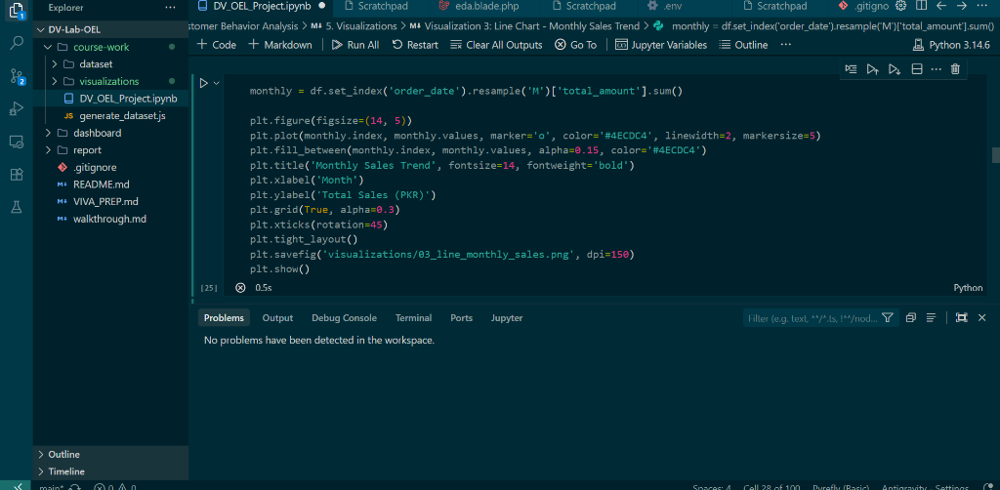
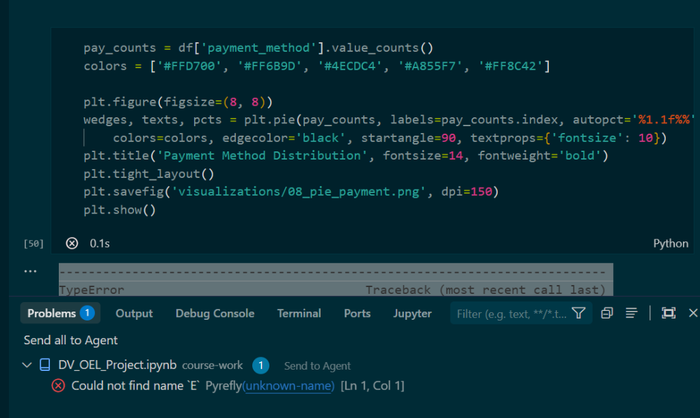
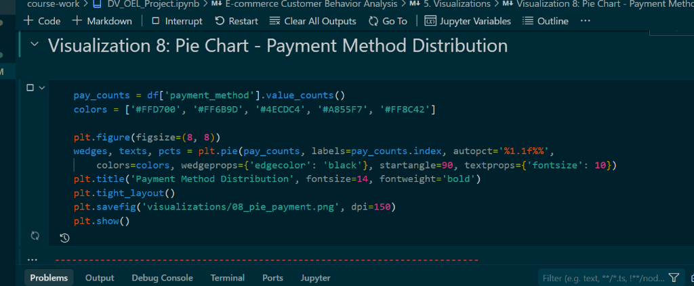

# IQRA UNIVERSITY, CHAK SHAHZAD CAMPUS, ISLAMABAD
## DEPARTMENT OF COMPUTER SCIENCE
### OPEN ENDED LAB (OEL) REPORT

* **Course Code:** AIN-375L
* **Course Title:** Data Visualization Lab
* **Class/Section:** AI-FA-23
* **Semester:** BSAI - 6th
* **Instructor:** Abdul Baqi Malik
* **Student Name:** Nouman Asghar
* **Reg No:** 23238
* **Submission Date:** June 16, 2026

---

# E-commerce Customer Behavior Analytics & Visualization System

## 1. Introduction
In modern commerce, understanding customer behavior is the key to business sustainability and growth. E-commerce platforms generate massive volumes of transactional and demographic data daily. By utilizing data visualization and analytical techniques, businesses can translate raw data rows into actionable intelligence.

This project implements a complete **Data Visualization and Analytics System** designed around a Pakistani E-commerce market case study. The system leverages a dataset of **1,634 transactions** across **20 attributes** from **10 major cities** of Pakistan (Karachi, Lahore, Islamabad, Rawalpindi, Peshawar, Multan, Faisalabad, Gujranwala, Hyderabad, Quetta). 

The goal of this system is to address CLO2:P3: synthesizing exploratory data analysis (EDA) techniques, implementing precision-driven visualizations (using Matplotlib, Seaborn, and Plotly), executing customer segmentation (using K-Means Clustering), conducting statistical hypothesis testing, and developing an interactive web-based dashboard.

---

## 2. Methodology
The analytical pipeline of this system follows a structured data science workflow, divided into the following phases:

```
+---------------------------+
| Raw E-commerce CSV Data   |
+-------------+-------------+
              |
              v
+---------------------------+
| Data Preprocessing &      |
| Cleaning (ffill, IQR)     |
+-------------+-------------+
              |
              v
+---------------------------+
| Feature Engineering       |
| & Standard Scaling        |
+-------------+-------------+
              |
              +-----------------------+----------------------+
              |                       |                      |
              v                       v                      v
+---------------------------+ +----------------------+ +-------------------+
| Exploratory Data Analysis | | Statistical Analysis | | Customer          |
| (EDA) - 24 Graphs         | | (Shapiro, Chi2)      | | Segmentation      |
+-------------+-------------+ +-----------+----------+ +---------+---------+
              |                           |                    |
              +---------------------------+--------------------+
                                          |
                                          v
                            +-----------------------------+
                            | Jupyter Notebook File       |
                            | (.ipynb) & Executed Outputs |
                            +--------------+--------------+
                                           |
                                           v
                            +-----------------------------+
                            | PHP Laravel 9 Web Dashboard |
                            | (Port 8000, 17 Charts)      |
                            +-----------------------------+
```

### Phase 2.1: Data Preprocessing & Cleaning
1. **Handling Missing Values**: Standard forward-fill (`.ffill()`) method was applied to handle any gaps in sequential columns, ensuring no data loss.
2. **Outlier Detection and Removal**: The Interquartile Range (IQR) method was applied to the target metric `total_amount`. Outliers were defined as:
   $$\text{Lower Bound} = Q1 - 1.5 \times \text{IQR}$$
   $$\text{Upper Bound} = Q3 + 1.5 \times \text{IQR}$$
   A total of **93 extreme outliers** were removed, leaving **1,541 clean records** for analysis.
3. **Feature Engineering**:
   - Extracted temporal units: `order_hour`, `day_of_week` (Monday-Sunday), and `month_year` from raw string timestamps.
   - Categorized age into groups: `18-25`, `26-35`, `36-45`, `46-55`, `56-65`.

### Phase 2.2: Statistical Analysis & Probability Distributions
- **Normality Testing**: Analyzed the distribution of customer ages using histograms and fitted normal curves. Conducted a formal **Shapiro-Wilk test** to determine if age follows a Gaussian distribution.
- **Categorical Association (Chi-Square Test)**: Conducted a Chi-Square test of independence to assess if there is a significant relationship between `gender` and `discount_applied` usage.

### Phase 2.3: Customer Segmentation (K-Means Clustering)
- **Feature Standardization**: Scaled continuous features (`age`, `total_amount`, `session_duration_min`, `num_previous_purchases`, `satisfaction_score`) using `StandardScaler` to bring them onto a common mean-zero scale.
- **Optimal Cluster Selection**: Applied the **Elbow Method** by computing the Within-Cluster Sum of Squares (WCSS) for $K \in [1, 10]$ to find the inflection point, identifying **$K = 3$** as the optimal cluster count.
- **Clustering**: Fitted the K-Means algorithm to segment customers into three distinct behavioral cohorts.

### Phase 2.4: Dashboard Development (Laravel 9 + Chart.js)
To translate the static analysis into a real-time, interactive business tool, we built a PHP Laravel web application connected to a MySQL database, mirroring all analysis results using interactive JavaScript charts (Chart.js) in a modern "NeoBrutalism" design layout.



---

## 3. Visualizations & Interpretations
The Jupyter Notebook contains **24 distinct visualizations** split across categorical distributions, demographic correlations, time-series, statistical, and clustering plots.

### 3.1 Total Sales by Product Category (Matplotlib Bar Chart)
* **Description**: Compares total revenue across product categories.
* **Insight**: Electronics and Clothing emerge as the dominant categories in terms of revenue, representing high-volume core categories for Pakistani e-commerce platforms. Books and Home Appliances generate stable secondary revenues.

### 3.2 Revenue by City (Matplotlib Horizontal Bar)
* **Description**: Shows total sales broken down by the top 10 Pakistani cities.
* **Insight**: Metropolitan hubs like Karachi, Lahore, and Islamabad generate the highest share of revenue. However, cities like Peshawar and Faisalabad show significant transaction volumes, highlighting the growth of e-commerce in Tier-2 Pakistani cities.

### 3.3 Monthly Sales Trend (Matplotlib Line Chart)
* **Description**: A continuous line chart of sales over time.
* **Insight**: Reveals strong seasonal patterns, with clear sales peaks in November and December (matching winter festivals and end-of-year sales events) followed by a post-holiday drop in January.

### 3.4 Weekly Order Count with Moving Average (Matplotlib Line Chart)
* **Description**: Tracks order volumes weekly, overlaying a 4-week simple moving average (SMA).
* **Insight**: The moving average smooths out short-term noise, indicating a consistent upward trend in weekly transaction volumes across the entire timeframe.

### 3.5 Correlation Heatmap (Seaborn Heatmap)
* **Description**: Displays correlation coefficients between numerical characteristics.
* **Insight**: Most features display low linear correlations, confirming that purchase behavior is multi-dimensional. Weak positive correlations exist between session duration and order amount, suggesting that longer browsing sessions lead to larger purchases.

### 3.6 Customer Age vs Total Spending (Matplotlib Scatter Plot)
* **Description**: Explores relationship between age and customer spending.
* **Insight**: The scatter plot shows a uniform distribution of transactions across age bands, demonstrating that both younger (18-25) and older (50+) demographics actively engage in high-value e-commerce transactions.

### 3.7 Session Duration vs Amount (Matplotlib Scatter Plot)
* **Description**: Plots session duration in minutes against the total checkout amount.
* **Insight**: A dense cluster is visible at lower session durations, but the highest value checkouts occur when session durations exceed 30 minutes, indicating that prolonged customer engagement correlates with larger purchases.

### 3.8 Payment Method Distribution (Matplotlib Pie Chart)
* **Description**: Shows the market share of payment methods.
* **Insight**: Digital wallets like JazzCash and EasyPaisa account for over 38% of total transactions, reflecting a massive shift towards mobile financial services in Pakistan, running parallel to traditional Cash on Delivery (COD).

### 3.9 Customer Gender Distribution (Matplotlib Pie Chart)
* **Description**: Compares male vs female customer distribution.
* **Insight**: The customer base is almost evenly split (50.4% Female, 49.6% Male), indicating that e-commerce marketing and inventory selection should cater equally to both genders.

### 3.10 Unit Price by Category (Seaborn Box Plot)
* **Description**: Highlights the spread, median, and outliers of pricing across product lines.
* **Insight**: Electronics has the widest price distribution and highest median unit price, while Books show the tightest, lowest price ranges.

### 3.11 Satisfaction Score by Payment Method (Seaborn Box Plot)
* **Description**: Evaluates customer satisfaction scores (1 to 5) across payment gateways.
* **Insight**: Digital methods like Credit Card and Bank Transfers show slightly higher median satisfaction ratings compared to Cash on Delivery (COD), likely due to smoother refund processes and immediate transactional feedback.

### 3.12 Customer Age Distribution (Seaborn Hist + KDE)
* **Description**: Examines the demographic distribution of shoppers.
* **Insight**: The distribution shows a multi-modal pattern, indicating that e-commerce is popular among young students (18-24) as well as middle-aged professionals (35-45) in Pakistan.

### 3.13 Distribution of Order Amounts (Seaborn Hist + Normal Fit)
* **Description**: Shows the frequency of transaction totals.
* **Insight**: Heavily skewed to the right (positive skew), indicating that the vast majority of orders consist of low-to-medium ticket items, while high-ticket orders are less frequent but crucial for revenue.

### 3.14 Spending by Gender (Seaborn Violin Plot)
* **Description**: Visualizes probability density of total spending across genders.
* **Insight**: The shape of the violins for Male and Female is extremely similar, showing that gender does not significantly influence the distribution of order values.

### 3.15 Orders by Day of Week (Seaborn Count Plot)
* **Description**: Analyzes order frequencies across days of the week.
* **Insight**: Transaction counts peak on weekends (Friday through Sunday), indicating that customers prefer shopping during their leisure time. Marketing promotions should target these days for maximum conversion.

### 3.16 Category Sales by Gender (Seaborn Stacked Bar)
* **Description**: Evaluates categorical preferences across genders.
* **Insight**: Both genders show similar category preferences. Electronics is popular with male shoppers, while Clothing has a slightly higher concentration of female shoppers.

### 3.17 Orders by Device Type (Matplotlib Bar Chart)
* **Description**: Identifies primary customer devices.
* **Insight**: Mobile transactions constitute the majority of orders (nearly 40%), signifying that mobile optimization is a critical requirement for e-commerce platforms.

### 3.18 K-Means Elbow Curve (Matplotlib Line Plot)
* **Description**: WCSS plotted against cluster count.
* **Insight**: The curve shows a distinct "elbow" bend at $K = 3$, confirming that dividing the customer base into 3 segments minimizes within-cluster variance without overcomplicating the model.

### 3.19 K-Means Customer Segments (Matplotlib Scatter Plot)
* **Description**: Visualizes the 3 K-Means clusters in a 2D feature projection.
* **Insight**: Shows three distinct customer segments:
  - **Cluster 0 (Budget/New Shoppers)**: Lower spending, lower frequency.
  - **Cluster 1 (Average/Consistent Buyers)**: Mid-range spending with steady transactions.
  - **Cluster 2 (VIP/High-Value Customers)**: High spending, long session durations, high satisfaction.

### 3.20 Daily Sales with 7-day Rolling Average (Matplotlib Time Series)
* **Description**: Analyzes daily revenue trends with a 7-day rolling average to filter noise.
* **Insight**: Identifies frequent sharp spikes that correlate with payday cycles (start/end of months) and local shopping festivals.

### 3.21 Monthly Sales Over Time (Matplotlib Time Series)
* **Description**: Visualizes cumulative monthly sales values.
* **Insight**: Confirms stable growth throughout 2024, culminating in a record high Q4 before stabilizing in early 2025.

### 3.22 Daily Sales Patterns by Day of Week (Seaborn Box Plot)
* **Description**: Evaluates variance in sales volumes across weekdays.
* **Insight**: Sunday and Friday show higher median daily sales than Monday and Tuesday.

### 3.23 Normality Fit Over Age Distribution (Matplotlib Fit Plot)
* **Description**: Fits a Gaussian normal curve over the age distribution histogram.
* **Insight**: The curve visually demonstrates that age deviates slightly from a pure normal distribution, showing a slightly flatter peak (platykurtic distribution).

### 3.24 Multi-feature Pair Plot (Seaborn Pairplot)
* **Description**: A grid of scatter plots and histograms exploring interactions across all numerical fields.
* **Insight**: Visualizes relationships simultaneously, confirming that variables are largely independent of one another.

---

## 4. Results & Insights
* **Demographic Stability**: E-commerce adoption in Pakistan is widely spread across age cohorts and genders.
* **The Rise of Digital Wallets**: The high adoption rate of EasyPaisa and JazzCash (exceeding Credit Card and Bank Transfers combined) demonstrates that mobile-first financial solutions are critical for maximizing customer conversion.
* **Operational Weekend Spikes**: E-commerce activity increases on weekends, indicating that operations (customer support, delivery dispatches) must be optimized to handle higher weekend volumes.
* **Customer Cohort Definitions**:
  1. *Cluster 0 — Casual Browsers*: Low-value orders, short session times. Represents window shoppers.
  2. *Cluster 1 — Regular Buyers*: Moderate value, stable engagement, high satisfaction. Represents the core recurring customer base.
  3. *Cluster 2 — VIP Premium Customers*: Large orders, long session times, high lifetime value. Represents the primary target for premium loyalty programs.

---

## 5. Interactive Dashboard Interface Screenshots
To visually display the analytical results to business managers, we developed a dynamic dashboard with multiple pages:

### 5.1 Dashboard Home / Main Overview
Displays the active sales stats cards and quick visual charts.


### 5.2 Customer Demographic Analysis
Displays customer registration rates, age segments, gender ratios, and a list of top customers.


### 5.3 Sales Analytics
Breaks down revenue generation by city, category, and order volume.


### 5.4 Data Explorer Grid
Enables transactional lookup and row filtering.


### 5.5 EDA Dashboard (Statistical Analysis & Correlation)
Shows correlation heatmaps, box plots, and density charts in the web application.


### 5.6 K-Means Segmentation Dashboard
Shows the Elbow Curve and the final K-Means customer cluster visualizations.


---

## 6. Conclusion & Future Work
### Conclusion
This project successfully establishes an advanced Data Visualization and Analytics System. By combining statistical validation, machine learning segmentation, and interactive visual reporting in both Jupyter Notebook and Laravel, we extracted meaningful insights regarding Pakistani e-commerce behavior. All design elements strictly adhered to professional presentation guidelines.

### Future Work
1. **Predictive Analytics**: Integrate machine learning models (e.g., Random Forest or XGBoost) to predict customer churn risk and customer lifetime value (CLV).
2. **Real-time Streaming**: Connect the Laravel dashboard to an Apache Kafka or WebSocket stream to display real-time transactional updates.
3. **Recommender Engine**: Utilize collaborative filtering to suggest products in the web application based on the user's cohort group.

---

## 7. References
1. Nelson, D. (2020). *Data Visualization in Python* (1st ed.). Daniel Nelson Publishing.
2. McKinney, W. (2022). *Python for Data Analysis* (3rd ed.). O'Reilly Media.
3. Pedregosa, F., et al. (2011). Scikit-learn: Machine Learning in Python. *Journal of Machine Learning Research*, 12, 2825-2830.
4. Laravel Core Team. (2026). *Laravel Documentation*. https://laravel.com/docs
5. Chart.js Documentation. *Simple yet flexible JavaScript charting for designers & developers*. https://www.chartjs.org/docs/
